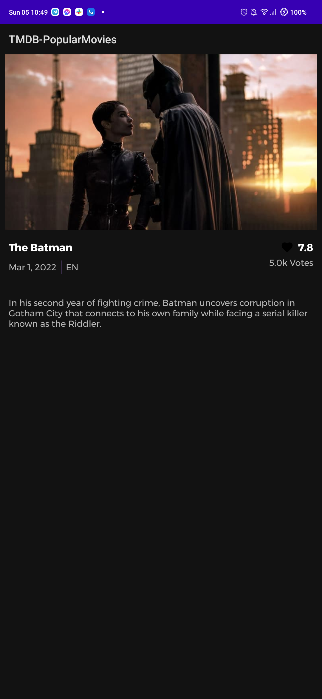

# TMDB Popular Movies

The purpose of this project is to:

- Build a smaller scope of my original
  project [MoviesBoard](https://github.com/mbobiosio/MoviesBoard)
- Implement Dependency Injection with Dagger-Hilt, follow Clean Architecture Principle, Room
  Database

## Disclaimer.

- Complex architectures like the pure clean architecture can also increase code complexity since
  decoupling your code also means creating lots of data transformations(mappers) and models, that
  may end up increasing the learning curve of your code to a point where it would be better to use a
  simpler architecture like MVVM.

## Challenges

- I have confirmed that the tmdb api does not indeed support pagination as provided by
  RemoteMediator. The direct implementation of this causes constant loop between page one and two. My approach to solve this loop is to use a different id as the remote key reference. The limitation however is that only page one is fetched always and scrolling doesn't increment pages at this time. A different approach would be without RemoteMediator however, the essence of this project was to work with the recommended tool for the usecase. 

## Technical Summary

- [Dependency Injection - Dagger-Hilt](https://dagger.dev/hilt/): Hilt is a dependency injection
  library for Android that reduces the boilerplate of doing manual dependency injection in your
  project.
- [Offline-First](https://applikeysolutions.com/blog/the-offline-first-approach-to-mobile-app-development):
  The offline-first apps, while still requiring a connection to the servers, don't need a constant
  internet connection. The data from servers is downloaded to the user's device and can still be
  accessed offline.
- [Single Source of Truth (SSOT)](https://developer.android.com/jetpack/docs/guide#truth): It is the
  practice of structuring information models and associated schemata such that every data element is
  stored exactly once. You can have an offline app and be sure your data always use one source and
  that is your database.
- [Model-View-ViewModel (MVVM)](https://en.wikipedia.org/wiki/Model%E2%80%93view%E2%80%93viewmodel):
  It is a software architectural pattern that facilitates the separation of the development of the
  graphical user interface.
- [Coroutines](https://developer.android.com/kotlin/coroutines): A coroutine is a concurrency design
  pattern that you can use on Android to simplify code that executes asynchronously.
- [Android Architecture Components](https://developer.android.com/topic/libraries/architecture):
  Collection of libraries that help you design robust, testable, and maintainable apps.
    - [Navigation](https://developer.android.com/guide/navigation): This component helps you
      implement navigation.
    - [LiveData](https://developer.android.com/topic/libraries/architecture/livedata): Data objects
      that notify views when the underlying database changes.
    - [ViewModel](https://developer.android.com/topic/libraries/architecture/viewmodel): Stores
      UI-related data that isn't destroyed on UI changes.
    - [Paging 3](https://developer.android.com/topic/libraries/architecture/paging): The Paging
      Library helps you load and display small chunks of data at a time. Loading partial data on
      demand reduces usage of network bandwidth and system resources.
    - [Room](https://developer.android.com/topic/libraries/architecture/room): The library provides
      an abstraction layer over SQLite to allow for more robust database access while harnessing the
      full power of SQLite.
        - [DatabaseView](https://developer.android.com/training/data-storage/room/creating-views):
          This annotation allows you to encapsulate a query into a class. Room refers to these
          query-backed classes as views, and they behave the same as simple data objects when used
          in a DAO.
- [Retrofit 2](https://github.com/JakeWharton/retrofit2-kotlinx-serialization-converter): A Retrofit
  2 Converter.Factory for Kotlin serialization.
- [Kotlin Gradle DSL](https://docs.gradle.org/current/userguide/kotlin_dsl.html): Gradle's Kotlin
  DSL provides an alternative syntax to the traditional Groovy DSL with an enhanced editing
  experience in supported IDEs, with superior content assist, refactoring, documentation, and more.
- [Moshi](https://github.com/square/moshi)
  & [Moshi Converter](https://github.com/square/retrofit/tree/master/retrofit-converters/moshi): A
  modern JSON library for Kotlin and Java. The converter uses Moshi for serialization to and from
  JSON.
- [Timber](https://github.com/JakeWharton/timber): A logger with a small, extensible API which
  provides utility on top of Android's normal Log class.

## Architecture.

### What is Clean Architecture?

A well planned architecture is extremely important for an app to scale and all architectures have one common goal- to manage complexity of your app. This isn't something to be worried about in smaller apps however it may prove very useful when working on apps with longer development lifecycle and a bigger team.

Clean architecture was proposed by [Robert C. Martin](https://en.wikipedia.org/wiki/Robert_C._Martin) in 2012 in the [Clean Code Blog](http://blog.cleancoder.com/uncle-bob/2012/08/13/the-clean-architecture.html) and it follow the SOLID principle.

<p align="center"></p>

The circles represent different layers of your app. Note that:

- The center circle is the most abstract, and the outer circle is the most concrete. This is called the [Abstraction Principle](https://en.wikipedia.org/wiki/Abstraction_principle_(computer_programming)). The Abstraction Principle specifies that inner circles should contain business logic, and outer circles should contain implementation details.

- Another principle of Clean Architecture is the [Dependency Inversion](https://en.wikipedia.org/wiki/Dependency_inversion_principle). This rule specifies that each circle can depend only on the nearest inward circle ie. low-level modules do not depend on high-level modules but the other way around.

### Why Clean Architecture?
- Loose coupling between the code - The code can easily be modified without affecting any or a large part of the app's codebase.
- Easier to test code.
- Separation of Concern - Different modules have specific responsibilities making it easier for modification and maintenance.

### S.O.L.I.D Principles.

- [__Single Responsibility__](https://en.wikipedia.org/wiki/Single-responsibility_principle): Each software component should have only one reason to change – one responsibility.

- [__Open-Closed__](https://en.wikipedia.org/wiki/Open%E2%80%93closed_principle#:~:text=In%20object%2Doriented%20programming%2C%20the,without%20modifying%20its%20source%20code.): You should be able to extend the behavior of a component, without breaking its usage, or modifying its extensions.

- [__Liskov Substitution__](https://en.wikipedia.org/wiki/Liskov_substitution_principle): If you have a class of one type, and any subclasses of that class, you should be able to represent the base class usage with the subclass, without breaking the app.

- [__Interface Segregation__](https://en.wikipedia.org/wiki/Interface_segregation_principle): It’s better to have many smaller interfaces than a large one, to prevent the class from implementing the methods that it doesn’t need.

- [__Dependency Inversion__](https://en.wikipedia.org/wiki/Dependency_inversion_principle): Components should depend on abstractions rather than concrete implementations. Also higher level modules shouldn’t depend on lower level modules.

## Getting started

There are a few ways to open this project.

### Android Studio

1. `Android Studio` -> `File` -> `New` -> `From Version control` -> `Git`
2. Enter `git@github.com:mbobiosio/TMDB-PopularMovies.git` into URL field an press `Clone` button 3,
   Build the project and run on an android device or emulator

### Command-line + Android Studio

1. Run `git clone git@github.com:mbobiosio/TMDB-PopularMovies.git` command to clone project
2. Open `Android Studio` and select `File | Open...` from the menu. Select cloned directory and
   press `Open` button
3. Build the project and run on an android device or emulator

You need to supply your tmdb API key. You can get a free api key from `themoviedb.org/`.

When you obtain the key, you can provide them to the app by creating `secure.properties` file in
your project root folder:

```properties
apiKey="api_key"
```

## Screenshots
 

## Conclusion
I have worked with multiple APIs with pagination support and of course, with RemoteMediator or dealing with PagingSource. Because of time constraints I have not done the following:
- Unit tests
- Trailer preview with embedded youtube